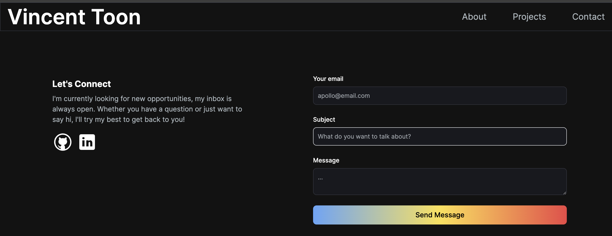

# Vincent Portfolio V3

## License

### 

### [MIT](https://opensource.org/licenses/MIT)

## Description

Next.js Portfolio application to display personal accomplishments for hiring/self-marketing purposes

By: [Vincent Toon](https://github.com/Vincenttoon)

## Table of Contents

- [Live Link](#live-link)

- [Installation](#installation)

- [Usage](#usage)

- [Things Learned](#things-learned)

- [Future Improvements](#future-improvements)

- [Questions?](#questions)

## Live Link

- [Live Link](https://vincent-portfolio-v3.vercel.app/)

## Installation

- Head to the repository to download or view this code: [Vincent Portfolio V3](https://github.com/Vincenttoon/vincent-portfolio-v3)

## Usage

- Visit webpage
- Browse portfolio
- Let me know what you think!

## Things Learned

- First Next.js project. Learned fundamentals, structure, functionality and installation of Next.js

- `npm i TypeAnimation` - a lightweight npm package that enables you to add dynamic and animated typing effects to your web projects. It's perfect for creating engaging and interactive user interfaces.

- Further practice creating jsx dynamic NavLinks and more reusable code.

- Familiar, but first use of `@heroicons`

- More practice using `emailjs/brower` (introduction to Resend, but not paying for a domain)

- Tailwind knowledge expanded

- Multiple different css implementations, including transform, translate, gradient, from-include-to

- `npm i framer-motion` - a versatile animation library for React that makes it easy to create fluid and expressive motion in your web applications.

- `npm i react-animated numbers` React component for animating numerical values with smooth transitions. It's perfect for creating dynamic and engaging interfaces with changing numeric content.

- `npm i react-type-animation` React component that brings dynamic and engaging typing animations to your web applications. Easily simulate the appearance of text being typed, creating a lively and interactive user experience.

## Future Improvements

- Currently, emailjs is not giving me the email of whoever sends the email ~facepalm~

- More projects to include, with more tabs (Portfolios, Games, Tools, etc...)

## Questions?

Questions, comments, or concerns? Please Email me at:

- vincenttoon22@gmail.com

